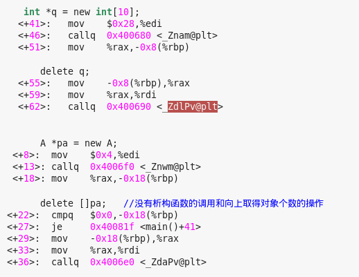
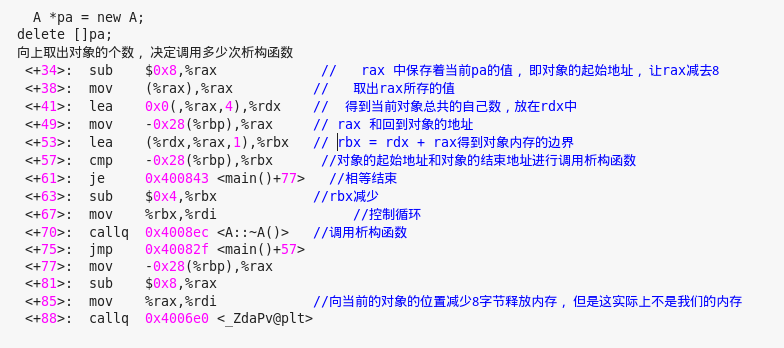

# 
 The some question of C++ 
#
1. 为何空类的大小不是零？
> 为了确保两个不同对象的地址不同，
> new返回的指针总是指向不同的单个对象
*****
2. 我们是否可以将析构函数定义为虚函数？
> 我们可以将一个析构函数定义为虚函数，
> 而且当我们用一个基类对象的指针指向派生类在堆上new出来的内存时，我们必须这样做，
> 如果不这样做，我们在delete 指针时就会调用基类的析构函数，但是我们的对象却是一个派生类的对象
> 于是就有可能出现内存泄漏
******
3. 如果我们用new去申请内存，但是却用delete[]去释放内存会出现问题吗？
     * 内置类型， 自定义的没有显示的写析构函数的类型:
>  因为我开辟的内存是连续的，而且我还能够知道这次我开辟了多少字节，所以在      释放的时候会自己释放，不会造成内存泄漏

    * 自定义的自己写了析构函数的类型：
>  有了自己的构造函数那么就不简简单单的只是开辟空间，还要调用自己写的构造函数， 来给我们的对象初始化。
> 如果释放的时候是delete [];
> 会根据当前对象的地址向上偏移拿到自己对象的个数，即使你对象是new A;也会这么做，然后根据这个数来调用析构函数，
> 出错的位置是，我释放内存时rax减8,开始释放，于是就出现问题了 
> 如果释放的时候是delete ;而开辟的时候是new A[];
> 那么会出现从中间释放.

*****
